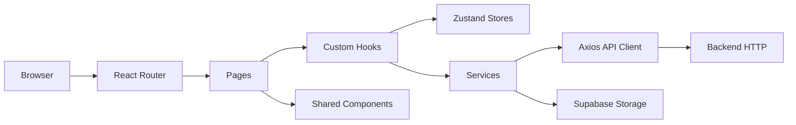

# Herramienta Diapositivas Poli - Frontend

Aplicacion frontend desarrollada con React y Vite para generar, visualizar, editar, presentar y exportar diapositivas creadas a partir de texto o archivos PDF. El sistema consume un backend HTTP para autenticacion y gestion de presentaciones, y usa Supabase Storage para catalogo de plantillas visuales.

## Resumen tecnico

Este frontend implementa cinco capacidades principales:

1. Autenticacion de usuarios con rutas publicas y protegidas.
2. Generacion de presentaciones desde PDF o texto libre.
3. Previsualizacion, modo presentacion y exportacion a PDF/PPTX.
4. Edicion visual de diapositivas con texto, listas, imagenes y fondos.
5. Biblioteca de imagenes de usuario y plantillas de fondo.

Hallazgos relevantes del analisis:

- La app usa `React Router` sin lazy loading de rutas.
- El estado global es minimo y se resuelve con `Zustand`.
- La sesion no se persiste en `localStorage` ni `sessionStorage`; el flujo depende de cookies HTTP y `withCredentials: true`.
- La exportacion pesada se carga bajo demanda con `import()` para `html2canvas`, `jspdf` y `pptxgenjs`.
- Existen piezas legacy o no usadas, como `PdfUploader.jsx`, `TextUploader.jsx`, `slideService.getSlides`, `slideService.getSlideById` y `useAddSlideTemplates.applyTemplateToSlide`.
- El script `npm run lint` esta roto en el estado actual del repositorio porque invoca `eslint` sin tener `eslint` declarado en `devDependencies`.

## Proposito funcional

La aplicacion permite a estudiantes o equipos academicos convertir contenido fuente en presentaciones editables, reduciendo el trabajo manual de diagramacion. El flujo tipico es:

1. El usuario inicia sesion.
2. Genera una presentacion desde un PDF o un bloque de texto.
3. Revisa la presentacion en modo preview.
4. Edita slides, textos, listas, imagenes y fondos.
5. Presenta el contenido en fullscreen o lo exporta a PDF/PPTX.

## Tecnologias detectadas

### Runtime

| Tecnologia | Uso en el proyecto |
| --- | --- |
| React 19 | UI, pages, componentes y hooks personalizados |
| Vite 7 | bundler, dev server y build de produccion |
| React Router DOM 7 | enrutamiento y guards |
| Zustand | estado global de autenticacion y presentacion activa |
| Axios | cliente HTTP con refresh automatico en respuestas 401 |
| Supabase JS | acceso a Storage para plantillas visuales |
| Sonner | notificaciones y confirmaciones |
| Lucide React | iconografia |
| react-colorful | selector de color en el editor |
| html2canvas | captura de slides para exportacion a PDF |
| jsPDF | generacion de PDF |
| PptxGenJS | generacion de PPTX |

### Desarrollo

| Tecnologia | Uso en el proyecto |
| --- | --- |
| Cypress | pruebas E2E |
| Biome | reglas de formato/lint configuradas en `biome.json` |
| @vitejs/plugin-react-swc | compilacion React con SWC |

## Arquitectura general



Resumen de capas:

- `pages/`: orquestan la experiencia completa por ruta.
- `components/`: contienen piezas visuales reutilizables y subarboles complejos del editor.
- `hooks/`: encapsulan logica de edicion, exportacion, preview, reorder y carga de datos.
- `services/`: concentran consumo HTTP y acceso a Supabase.
- `store/`: mantiene un estado global minimo con `authStore` y `presentationStore`.
- `router/`: aplica proteccion de acceso.
- `utils/`: reglas de validacion, plantillas y helpers del editor.

## Instalacion

### Requisitos previos

- Node.js 20 o superior recomendado
- npm
- Backend compatible disponible
- Variables de entorno configuradas

### Pasos

```bash
npm install
npm run dev
```

Por defecto Vite levantara la aplicacion en una URL local similar a `http://localhost:5173`.

## Configuracion inicial

1. Crear o ajustar el archivo `.env`.
2. Verificar que el backend acepte credenciales cross-site si frontend y backend estan en dominios distintos.
3. Verificar que el bucket de Supabase exista y tenga acceso publico para plantillas si se requiere la funcionalidad de fondos.
4. Ejecutar `npm install`.
5. Ejecutar `npm run dev`.

## Variables de entorno usadas

El repositorio referencia estas variables:

| Variable | Uso |
| --- | --- |
| `VITE_BACKEND_URL` | base URL del backend para Axios |
| `VITE_SUPABASE_URL` | URL del proyecto Supabase |
| `VITE_SUPABASE_ANON_KEY` | clave anon/publicable usada por el cliente Supabase |
| `VITE_SUPABASE_BUCKET` | bucket de Storage donde se listan templates |

Notas:

- `src/api/axios.js` usa `VITE_BACKEND_URL` con fallback a `http://localhost:3000`.
- `src/lib/supabaseClient.js` requiere `VITE_SUPABASE_URL` y `VITE_SUPABASE_ANON_KEY`.
- `src/services/templateService.js` usa `VITE_SUPABASE_BUCKET` con fallback a `images`.

## Scripts disponibles

| Script | Estado observado | Descripcion |
| --- | --- | --- |
| `npm run dev` | Declarado | inicia Vite en desarrollo |
| `npm run build` | Verificado | compila correctamente fuera del sandbox; reporta chunks grandes |
| `npm run preview` | Declarado | sirve la build de produccion |
| `npm run lint` | Falla | invoca `eslint .`, pero `eslint` no esta instalado |

Observaciones:

- No existe script `test`, `cypress:open` ni `cypress:run`.
- Cypress esta instalado, pero su ejecucion depende de comandos manuales como `npx cypress open` o `npx cypress run`.

## Estructura del proyecto

```text
.
|-- cypress/
|   |-- e2e/
|   |-- fixtures/
|   `-- support/
|-- public/
|-- src/
|   |-- api/
|   |-- assets/
|   |-- auth/
|   |-- components/
|   |-- hooks/
|   |-- lib/
|   |-- pages/
|   |-- router/
|   |-- services/
|   |-- store/
|   |-- styles/
|   `-- utils/
|-- .env
|-- biome.json
|-- cypress.config.js
|-- package.json
|-- vercel.json
`-- vite.config.js
```

## Flujos funcionales principales

### Generacion

- `Dashboard.jsx` permite alternar entre carga de PDF y entrada de texto.
- La generacion llama `uploadPDF()` o `sendText()` desde `presentationService`.
- Al finalizar, el usuario navega a `/preview/:id`.

### Preview y exportacion

- `PresentationPreview.jsx` carga la presentacion desde store o backend.
- `usePresentationExport()` construye PDF y PPTX.
- `usePresentationPlayer()` controla fullscreen y navegacion entre slides.

### Edicion

- `EditPresentation.jsx` combina `SlideSidebar`, `EditToolbar`, `ResponsiveEditCanvas` y `AddElementPanel`.
- `usePresentationEditor()` administra seleccion, cambios locales, guardado y borrado de elementos.
- `useSlideCanvasInteractions()` resuelve drag/resize en el canvas.

## Pruebas detectadas

El repositorio (en la rama automatized-tests) incluye pruebas E2E para:

- login y registro
- carga de informacion
- generacion de presentaciones
- historial de presentaciones
- edicion de texto
- gestion de imagenes
- exportación de presentaciones
- reordenar diapositivas
- creación y eliminación de diapositivas

Riesgos observados:

- `cypress.config.js` apunta a `https://presentai.juajsia.lat`.
- `cypress/support/commands.js` contiene credenciales hard-coded.
- No existe script npm dedicado para las pruebas.

## Deuda tecnica y mejoras detectadas

| Categoria | Hallazgo | Impacto |
| --- | --- | --- |
| Routing | no existe ruta 404 ni fallback | UX incompleta ante URLs invalidas |
| Performance | la build reporta chunks grandes, especialmente en exportacion | carga inicial y cache suboptimas |
| Codigo muerto | `PdfUploader.jsx` y `TextUploader.jsx` no estan conectados al arbol activo | aumenta mantenimiento innecesario |
| Seguridad | `.env` versionado y credenciales de Cypress hard-coded | exposicion operativa innecesaria |
| Robustez | varios `catch` solo muestran toast o `console.error` sin rollback | errores parciales pueden dejar UI inconsistente |
| Consistencia | existe logica duplicada para aplicar templates a slides | dificulta evolucion del editor |

## Documentacion

La documentacion tecnica detallada se encuentra en `docs/`:

- [ARCHITECTURE.md](docs/ARCHITECTURE.md)
- [ROUTING.md](docs/ROUTING.md)
- [COMPONENTS.md](docs/COMPONENTS.md)
- [SERVICES.md](docs/SERVICES.md)
- [AUTH.md](docs/AUTH.md)
- [STATE.md](docs/STATE.md)
- [FORMS.md](docs/FORMS.md)
- [FILES.md](docs/FILES.md)
- [SOCKETS.md](docs/SOCKETS.md)
- [STYLES.md](docs/STYLES.md)
- [DEPLOYMENT.md](docs/DEPLOYMENT.md)
- [SECURITY.md](docs/SECURITY.md)
- [CONTRIBUTING.md](docs/CONTRIBUTING.md)
