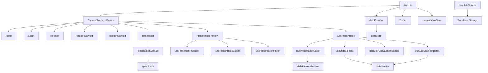
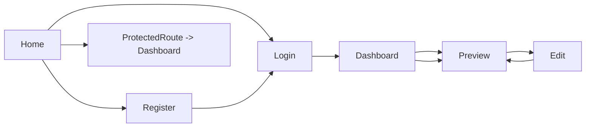
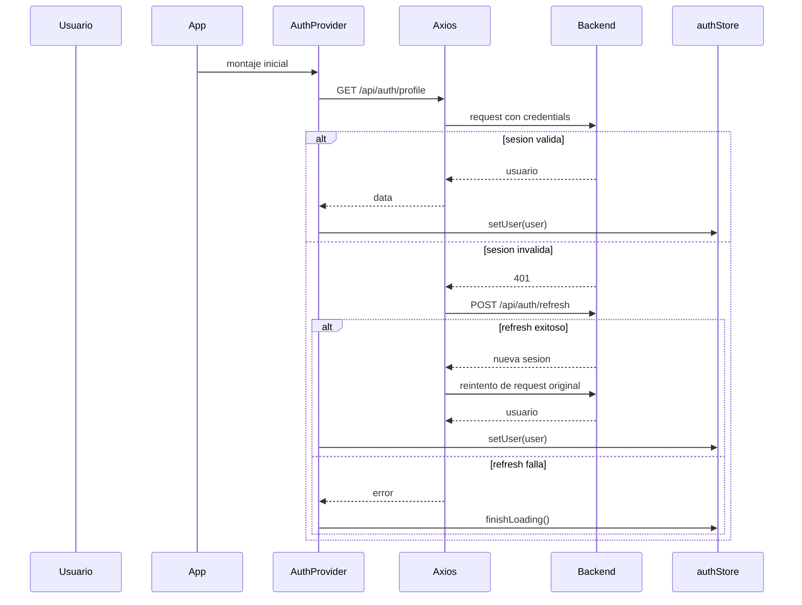

# Frontend Architecture

## Vision general

El frontend sigue una arquitectura por capas ligera orientada a features:

- La capa de rutas monta paginas completas.
- Cada pagina delega logica compleja a hooks especializados.
- Los hooks consumen servicios HTTP o clientes externos.
- El estado global se mantiene pequeno y solo guarda autenticacion y la presentacion activa.
- Los componentes visuales concentran renderizado y composicion de UI.

No existe una capa formal de `layouts/`. En su lugar, `Navbar` y `Footer` funcionan como primitivas de layout compartido montadas desde paginas o desde `App.jsx`.

## Patron predominante

Patrones identificados:

| Patron | Presencia |
| --- | --- |
| Container/Presentational | Parcial. Las `pages` y hooks actuan como contenedores; varios componentes siguen siendo mixtos |
| Feature-based organization | Alta. Editor, preview, auth y dashboard se entienden por modulos funcionales |
| Service layer | Alta. El consumo HTTP esta concentrado en `src/services` |
| Global state minimalista | Alta. `Zustand` solo guarda autenticacion y presentacion actual |
| Custom hooks for orchestration | Alta. La mayor parte de la logica compleja del editor y exportacion esta en hooks |

## Diagrama de alto nivel

## Organizacion de carpetas

| Carpeta | Responsabilidad principal |
| --- | --- |
| `src/pages` | vistas por ruta |
| `src/components` | piezas visuales reutilizables y subestructuras del editor |
| `src/hooks` | logica de negocio y sincronizacion compleja |
| `src/services` | llamadas HTTP y acceso a recursos externos |
| `src/store` | estado global con Zustand |
| `src/router` | guards de acceso |
| `src/auth` | inicializacion de sesion |
| `src/api` | cliente Axios e interceptor |
| `src/lib` | clientes externos, hoy Supabase |
| `src/utils` | validaciones y helpers del editor |
| `src/styles` | hojas CSS globales por pantalla/feature |

## Separacion de responsabilidades

### Routing y bootstrap

- `src/main.jsx` solo monta `App`.
- `src/App.jsx` define rutas, provider de autenticacion y `Footer`.
- `ProtectedRoute.jsx` y `SesionRoute.jsx` filtran acceso.

### Auth

- `AuthProvider.jsx` hace bootstrap de sesion llamando `getProfile()`.
- `authStore.js` conserva el usuario autenticado e indicadores basicos.
- `authService.js` concentra login, logout, register, forgot/reset.

### Presentaciones

- `presentationService.js` cubre generacion, listado, detalle y borrado.
- `presentationStore.js` solo cachea la presentacion activa.
- `usePresentationLoader()` evita recargar si la presentacion ya esta en store.

### Editor

- `usePresentationEditor()` es el orquestador central del modo edicion.
- `SlideCanvas`, `SlideElementRenderer` y `useSlideCanvasInteractions()` resuelven seleccion, arrastre y resize.
- `SlideSidebar` y `useSlideSidebar()` manejan agregar, borrar, duplicar y reorder de slides.
- `AddElementPanel` carga templates e imagenes del usuario.

### Preview y exportacion

- `PresentationPreview.jsx` orquesta render, exportacion y modo presentacion.
- `usePresentationExport()` exporta a PDF o PPTX.
- `PresentationPlayer` y `usePresentationPlayer()` resuelven fullscreen y navegacion.

## Flujo de navegacion

## Flujo de autenticacion

## Manejo de estado

| Tipo de estado | Ubicacion | Uso |
| --- | --- | --- |
| Global auth | `authStore` | usuario, auth flag, loading inicial |
| Global presentacion | `presentationStore` | cache temporal de la presentacion activa |
| Local por pagina | `useState` en paginas y hooks | formularios, paneles, seleccion, loading local |
| Estado derivado | hooks | export status, present mode, toolbar state, drag state |

No hay `Redux`, `Context API` de negocio, `RxJS`, `signals` ni persistencia de store en storage del navegador.

## Decisiones arquitectonicas valiosas

- La exportacion pesada se importa bajo demanda, reduciendo parte del costo inicial.
- El editor traslada logica compleja a hooks reutilizables.
- La capa de servicios esta bien separada del render.
- La autenticacion depende de cookies y evita guardar tokens en `localStorage`.

## Deuda tecnica detectada

| Hallazgo | Evidencia |
| --- | --- |
| Falta un layout formal | `Navbar` y `Footer` se montan manualmente desde varias pantallas |
| Falta una ruta 404 | `App.jsx` no define wildcard route |
| Hay codigo legacy/no usado | `PdfUploader.jsx`, `TextUploader.jsx`, helpers no consumidos |
| Hay logica duplicada de templates | `EditPresentation.jsx` aplica template y `useAddSlideTemplates()` tiene otra funcion similar |
| El editor concentra demasiadas responsabilidades | `usePresentationEditor()` mezcla seleccion, persistencia, toolbar, keyboard shortcuts y creacion de elementos |

## Mejoras recomendadas

1. Introducir rutas lazy para `Dashboard`, `PresentationPreview` y `EditPresentation`.
2. Crear un layout compartido para paginas publicas y privadas.
3. Dividir `usePresentationEditor()` en hooks mas pequenos por dominio: seleccion, persistencia, toolbar y creacion de elementos.
4. Centralizar contratos de datos de slides/elementos para evitar inconsistencias entre frontend y backend.
5. Eliminar o reincorporar componentes legacy que ya no forman parte del flujo activo.
