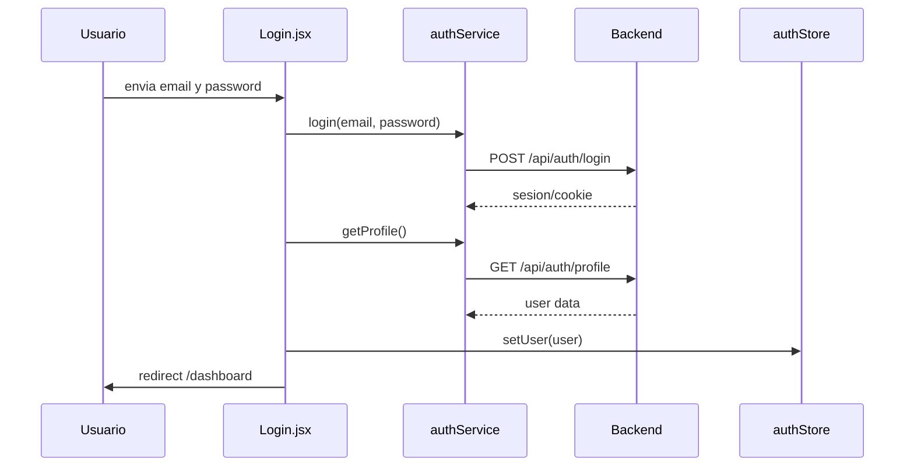

# Authentication

## Resumen

El frontend implementa autenticacion basada en sesion remota. La evidencia tecnica apunta a una estrategia con cookies HTTP:

- `axios` usa `withCredentials: true`
- no hay uso de `localStorage`, `sessionStorage` ni `document.cookie`
- el estado local de autenticacion solo vive en `authStore`
- ante `401`, el interceptor intenta `POST /api/auth/refresh`

## Modulos involucrados

| Modulo | Responsabilidad |
| --- | --- |
| `src/auth/AuthProvider.jsx` | bootstrap de sesion al cargar la app |
| `src/store/authStore.js` | usuario actual, flag `isAuthenticated`, flag `loading` |
| `src/services/authService.js` | llamadas HTTP de auth |
| `src/router/ProtectedRoute.jsx` | protege rutas privadas |
| `src/router/SesionRoute.jsx` | bloquea pantallas auth si ya existe sesion |
| `src/components/Navbar.jsx` | logout y presentacion del usuario autenticado |

## Flujo de inicio de sesion

## Flujo de bootstrap de sesion

Al montar la aplicacion:

1. `AuthProvider` ejecuta `getProfile()`.
2. Si la respuesta es valida, llama `setUser(user)`.
3. Si falla, llama `finishLoading()`.
4. Los guards esperan hasta que `loading` sea `false`.

## Flujo de recuperacion de password

| Paso | Vista | Servicio |
| --- | --- | --- |
| solicitar link | `ForgotPassword.jsx` | `forgotPassword(email)` |
| validar token | `ResetPassword.jsx` | `validateResetToken(token)` |
| guardar nueva password | `ResetPassword.jsx` | `resetPassword(token, password)` |

## Registro

`Register.jsx` valida:

- nombre no vacio y solo letras/espacios
- correo con dominio `@elpoli.edu.co`
- password con minimo 8 caracteres, mayuscula, numero y simbolo
- confirmacion igual al password

## Manejo de JWT o tokens

No hay acceso directo del frontend a un JWT almacenado manualmente. La implementacion observable sugiere:

- sesion persistida del lado backend
- posible refresh token en cookie
- rehidratacion desde `/api/auth/profile`

Esto es una inferencia sustentada por el codigo, no una confirmacion criptografica del mecanismo interno del backend.

## Persistencia de sesion

| Mecanismo | Detectado |
| --- | --- |
| `localStorage` | no |
| `sessionStorage` | no |
| `document.cookie` manual | no |
| cookies HTTP via `withCredentials` | si, inferido |
| persist middleware de Zustand | no |

## Refresh token

Comportamiento detectado:

- Si un request responde `401`, el interceptor intenta `POST /api/auth/refresh`.
- Si el refresh funciona, reintenta el request original.
- Si el refresh falla, el error se propaga.

Limitacion:

- No existe un flujo centralizado de logout automatico al fallar refresh.
- Tampoco hay limpieza explicita del store desde el interceptor.

## Proteccion de rutas

| Guard | Protege | Logica |
| --- | --- | --- |
| `ProtectedRoute` | `dashboard`, `preview`, `edit` | expulsa al login si no hay sesion |
| `SesionRoute` | `login`, `register`, `forgot-password`, `reset-password` | evita volver a auth si el usuario ya esta autenticado |

## Riesgos y observaciones

| Hallazgo | Impacto |
| --- | --- |
| `Login` hace `login()` y luego `getProfile()` | doble request para el mismo objetivo |
| No existe listener global de expiracion de sesion | la UX depende del siguiente request fallido |
| El store solo guarda estado en memoria | la app siempre requiere bootstrap remoto al recargar |
| El loading de guards usa texto plano | experiencia basica durante la validacion inicial |

## Recomendaciones

1. Centralizar el flujo de sesion expirada y logout forzado dentro del interceptor.
2. Estandarizar respuestas de auth para evitar el doble request post-login si el backend ya devuelve el perfil.
3. Agregar una pagina o componente visual de `session expired`.
4. Documentar formalmente si el backend usa access token, refresh token, cookies `httpOnly`, `sameSite` y `secure`.
