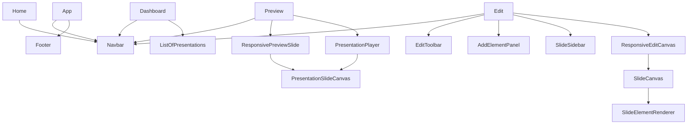

# Components

## Vision general

El proyecto usa componentes React funcionales organizados por responsabilidad visual. La mayor densidad funcional esta en el editor de presentaciones y en el preview/exportador.

## Mapa de relacion

## Componentes compartidos

| Componente | Proposito | Props clave | Eventos/efectos | Reutilizacion |
| --- | --- | --- | --- | --- |
| `Navbar` | navegacion superior y logout | sin props | navega, llama `logout()` y lee `authStore` | `Home`, `Dashboard`, `Preview`, `Edit` |
| `Footer` | pie institucional global | sin props | ninguno | montado desde `App.jsx` |
| `Logo` | branding textual con icono | sin props | ninguno | `Navbar`, `Login`, `Register` |

## Dashboard y listados

| Componente | Proposito | Props | Eventos/outputs |
| --- | --- | --- | --- |
| `ListOfPresentations` | listar presentaciones del usuario con miniatura, fecha y acciones | sin props | carga `getPresentations()`, navega a preview, borra presentacion |

Observaciones:

- El dashboard principal integra directamente el formulario de generacion en la pagina, no en componentes dedicados.
- `PdfUploader.jsx` y `TextUploader.jsx` existen, pero no forman parte del flujo activo.

## Preview y presentacion

| Componente | Proposito | Props clave | Outputs |
| --- | --- | --- | --- |
| `ResponsivePreviewSlide` | adapta una slide al ancho disponible manteniendo proporcion | `slide`, `ref` | registra nodo para exportacion |
| `PresentationSlideCanvas` | render de solo lectura de una slide | `slide`, `ref` | ningun callback; solo render |
| `PresentationPlayer` | overlay fullscreen para presentar | `slides`, `currentSlideIndex`, `onNextSlide`, `onPreviousSlide`, `onClose`, `presentationTitle` | navegacion entre slides y cierre |

## Editor visual

| Componente | Proposito | Props clave | Outputs |
| --- | --- | --- | --- |
| `EditToolbar` | toolbar contextual para formato de elementos | `selectedElement`, callbacks de formato, props de estado | aplica cambios tipograficos, alineacion, posicion, color, lista e imagen |
| `AddElementPanel` | panel lateral flotante para agregar texto, listas, imagenes y fondos | `onAddText`, `onAddImage`, `onAddList`, `onAddTemplate`, `onApplyTemplate` | crea elementos, sube imagenes, selecciona templates |
| `SlideSidebar` | listado lateral de slides con seleccion y acciones | `slides`, `selectedSlideIndex`, `onSelectSlide`, `presentationData`, `onPresentationChange` | agregar, duplicar, borrar, reordenar |
| `SlideSidebarItem` | item individual del sidebar con menu contextual | multiples props de control | seleccion, drag and drop, menu y acciones |
| `ResponsiveEditCanvas` | wrapper responsive del canvas de edicion | `onStageHeightChange`, props passthrough para `SlideCanvas` | recalcula escala y altura |
| `SlideCanvas` | canvas editable de una slide | `selectedSlide`, `getTemplate`, callbacks de seleccion/edicion | delega render e interacciones |
| `SlideElementRenderer` | render y edicion por tipo de elemento | `element`, `selectedElement`, `editorRef`, callbacks | drag, resize, edicion inline de texto/listas |

## Props y contratos relevantes

### `PresentationSlideCanvas`

Entrada esperada:

- `slide.background`
- `slide.elements[]`
- cada `element` con `type`, `content`, `positionX`, `positionY`, `width`, `height`, `styles`, `zIndex`

Tipos de elemento soportados:

- `title`
- `text`
- `list`
- `image`

### `SlideElementRenderer`

Capacidades:

- seleccion
- doble click funcional sobre texto por repeticion de click
- edicion inline para `title`, `text` y `list`
- drag and drop
- resize con handles
- soporte de `maintainAspectRatio` en imagenes

## Componentes legacy o no usados

| Componente | Estado | Comentario |
| --- | --- | --- |
| `PdfUploader.jsx` | no usado | replica parcialmente la carga PDF del dashboard |
| `TextUploader.jsx` | no usado | replica parcialmente la carga de texto del dashboard |

## Complejidad destacada

| Componente | Motivo |
| --- | --- |
| `AddElementPanel` | mezcla UI, carga de plantillas, biblioteca de imagenes, upload, borrado y tracking de acceso |
| `EditToolbar` | concentra multiples menus emergentes y reglas por tipo de elemento |
| `SlideElementRenderer` | resuelve render, edicion y resize por tipo |
| `PresentationPlayer` | gestiona portal, fullscreen y navegacion visual |

## Mejoras recomendadas

1. Separar `AddElementPanel` en subcomponentes de texto, imagenes, listas y fondos en archivos propios.
2. Extraer contratos TypeScript o JSDoc para los modelos `Presentation`, `Slide` y `SlideElement`.
3. Eliminar componentes no usados o reubicarlos en una carpeta `legacy/` para reducir ruido.
4. Definir una libreria interna de componentes de UI para botones, menus y overlays, hoy dispersos entre CSS y componentes puntuales.
