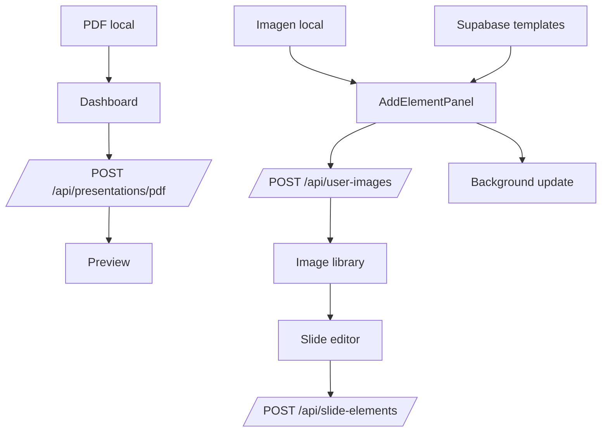

# File Handling

## Tipos de archivo detectados

| Tipo | Flujo | Estado |
| --- | --- | --- |
| PDF | generacion de presentaciones | soportado |
| Imagen de usuario | biblioteca y agregado a slides | soportado |
| Imagen template | fondos desde Supabase | soportado |
| PDF exportado | salida de presentaciones | soportado |
| PPTX exportado | salida de presentaciones | soportado |
| Video | no detectado | no soportado |
| Documentos Word/PowerPoint de entrada | no detectado | no soportado |

## Carga de PDF

Ubicacion principal: `Dashboard.jsx`

Reglas:

- tipo MIME debe ser `application/pdf`
- peso maximo 3 MB
- el numero de diapositivas se envia junto con el archivo

Servicio usado:

- `presentationService.uploadPDF(file, numberOfSlides)`
- endpoint `POST /api/presentations/pdf`

Implementacion:

- construye `FormData`
- setea `Content-Type: multipart/form-data`
- navega a preview cuando el backend responde

## Carga de imagenes de usuario

Ubicacion principal: `AddElementPanel.jsx`

Servicio usado:

- `getUserImages()`
- `uploadUserImage(file, onProgress)`
- `markUserImageAsAccessed(imageId)`
- `deleteImage(id)`

Capacidades:

- carga al backend con `FormData`
- progreso de subida usando `onUploadProgress`
- biblioteca visual ordenada por `lastAccessedAt` o `createdAt`
- eliminacion con confirmacion
- seleccion para insertar en el slide

## Templates de fondo

Fuente:

- `templateService.getTemplates()`
- bucket Supabase, carpeta `slides/`

Uso:

- `AddElementPanel` los lista
- se puede aplicar a slide actual
- se puede crear una nueva slide usando el template seleccionado

## Render dinamico de archivos

### Imagenes

Las imagenes se renderizan en:

- `SlideElementRenderer`
- `PresentationSlideCanvas`
- miniaturas de biblioteca en `AddElementPanel`

Contrato esperado:

- `element.content.resolvedImage.url` o `element.content.resolvedImage.image`

### Fondos

Los fondos de slide usan:

- `background.type === 'image'`
- `background.url` o `background.image`

### Exportacion

`usePresentationExport()` soporta:

- captura a PDF a partir del DOM renderizado
- reconstruccion semantica a PPTX usando coordenadas y estilos

## Flujo de archivos

## Previews

| Caso | Preview detectado |
| --- | --- |
| PDF de entrada | no hay preview del archivo; solo nombre seleccionado |
| Imagen de usuario | preview visual en la biblioteca lateral |
| Slide generada | preview completo en `PresentationPreview` |
| Slide en modo edicion | preview editable en `ResponsiveEditCanvas` |

## Limitaciones y riesgos

| Hallazgo | Impacto |
| --- | --- |
| No hay validacion cliente explicita de tipo/peso para imagenes | depende del backend y del atributo `accept` |
| No hay retry o rollback de upload | errores de red obligan a reintentar manualmente |
| Se usan URLs externas en `img` y `backgroundImage` | dependencia de CORS y disponibilidad externa |
| El maximo de 3 MB solo aplica al PDF | politicas para imagenes no estan documentadas en el frontend |

## Recomendaciones

1. Agregar validacion de tipo y peso para imagenes antes de subir.
2. Crear un contrato documentado para `resolvedImage`, `background` y metadatos de biblioteca.
3. Mostrar errores de upload por causa especifica cuando el backend los entregue.
4. Considerar thumbnails optimizados si la biblioteca de imagenes crece.
