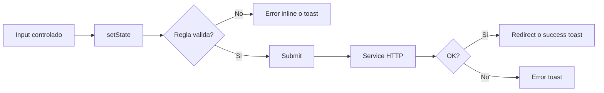

# Forms

## Resumen

El frontend no usa bibliotecas de formularios como `react-hook-form`, `Formik` o validadores por esquema. Todos los formularios son controlados manualmente con `useState`, atributos HTML (`required`) y utilidades de validacion en `src/utils/validatesInputs.js`.

## Formularios principales

| Pantalla | Formulario | Campos |
| --- | --- | --- |
| `Login.jsx` | inicio de sesion | `email`, `password` |
| `Register.jsx` | registro | `fullName`, `email`, `password`, `confirmPassword` |
| `ForgotPassword.jsx` | recuperacion | `email` |
| `ResetPassword.jsx` | cambio de password | `password`, `confirmPassword` |
| `Dashboard.jsx` | generacion desde texto o PDF | `file` o `text`, `numberOfSlides` |

## Validaciones detectadas

### Utilidades compartidas

Archivo: `src/utils/validatesInputs.js`

| Funcion | Regla |
| --- | --- |
| `validateName` | solo letras y espacios |
| `validateEmail` | debe terminar en `@elpoli.edu.co` |
| `validatePassword` | minimo 8, una mayuscula, un numero y un simbolo |
| `validatePasswords` | igualdad entre password y confirmacion |

### Registro

`Register.jsx` implementa:

- validacion por campo en `blur`
- estado `touched`
- estado `errors`
- validacion completa previa al submit

Mensajes manejados:

- nombre requerido o invalido
- email requerido o invalido
- password requerida o invalida
- confirmacion requerida o inconsistente

### Reset password

`ResetPassword.jsx` reutiliza:

- `validatePassword`
- `validatePasswords`

Adicionalmente valida el token antes de renderizar el formulario.

### Dashboard

Reglas de generacion:

| Campo | Regla |
| --- | --- |
| `numberOfSlides` | minimo 4, maximo 20 |
| PDF | tipo `application/pdf` |
| PDF | peso maximo 3 MB |
| Texto | no vacio |

## Manejo de errores

| Formulario | UX de error |
| --- | --- |
| Login | `toast.error('Credenciales Incorrectas')` |
| Register | mensajes inline + toast general |
| ForgotPassword | toast exito/error |
| ResetPassword | mensaje inline de validacion + toast |
| Dashboard | toast por archivo invalido, texto vacio o error de backend |

## Flujo tipico de un formulario

## Debilidades observadas

| Debilidad | Impacto |
| --- | --- |
| Validacion repetida entre componentes | mayor mantenimiento |
| No hay esquema comun de errores de backend | experiencia inconsistente |
| `Register.jsx` revisa `err.status` | podria no detectar correctamente el `409` de Axios |
| No hay sanitizacion especial de texto | depende del render seguro de React y de validaciones backend |

## Recomendaciones

1. Crear un hook comun o utilidades reutilizables para formularios auth.
2. Migrar a una libreria de forms si el numero de formularios crece.
3. Normalizar el acceso a status/message en errores Axios.
4. Agregar `env.example` y mensajes operativos claros para fallos de configuracion.
