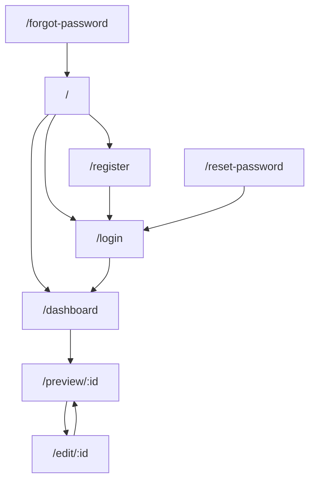
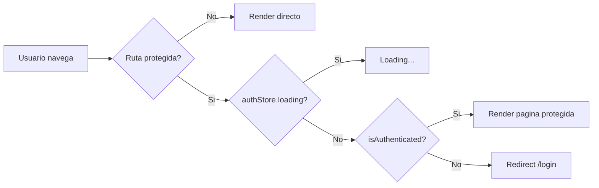

# Routing

## Stack de routing

- `react-router-dom@7`
- `BrowserRouter`
- rutas declarativas en `src/App.jsx`
- guards custom basados en `Zustand`

No se detecto lazy loading de rutas. Todas las paginas se importan de forma estatica en `App.jsx`.

## Tabla de rutas

| Ruta | Pagina | Tipo | Guard | Proposito |
| --- | --- | --- | --- | --- |
| `/` | `Home` | publica | no | landing y acceso inicial |
| `/login` | `Login` | publica condicional | `SesionRoute` | inicio de sesion |
| `/forgot-password` | `ForgotPassword` | publica condicional | `SesionRoute` | solicitud de recuperacion |
| `/reset-password` | `ResetPassword` | publica condicional | `SesionRoute` | cambio de password por token |
| `/register` | `Register` | publica condicional | `SesionRoute` | registro de usuario |
| `/dashboard` | `Dashboard` | protegida | `ProtectedRoute` | generacion y listado de presentaciones |
| `/preview/:id` | `PresentationPreview` | protegida | `ProtectedRoute` | lectura, exportacion y presentacion |
| `/edit/:id` | `EditPresentation` | protegida | `ProtectedRoute` | edicion visual de slides |

## Guards

### `ProtectedRoute`

Comportamiento:

- Si `loading` es `true`, muestra `Loading...`.
- Si `isAuthenticated` es `false`, redirige a `/login`.
- Si la sesion esta activa, renderiza el `children`.

### `SesionRoute`

Comportamiento:

- Si `loading` es `true`, muestra `Loading...`.
- Si `isAuthenticated` es `true`, redirige a `/dashboard`.
- Si no hay sesion, permite entrar a login/registro/recuperacion.

## Diagrama de navegacion

## Flujo de proteccion

## Lazy loading

Hallazgo:

- No hay `React.lazy()` ni `Suspense` para paginas.
- Si hay `import()` dinamico en `usePresentationExport()` para librerias pesadas de exportacion, pero eso no aplica a routing.

## Estructura de navegacion funcional

| Punto de entrada | Destinos principales |
| --- | --- |
| `Home` | `Dashboard`, `Register`, `Login` |
| `Dashboard` | `PresentationPreview` de una presentacion nueva o existente |
| `PresentationPreview` | `EditPresentation`, fullscreen, exportacion |
| `EditPresentation` | regreso al preview anterior o a la pagina anterior del historial |

## Limitaciones observadas

| Limitacion | Impacto |
| --- | --- |
| No existe ruta wildcard (`*`) | URLs invalidas no tienen una experiencia 404 controlada |
| No hay nested routes | el layout se repite manualmente en paginas |
| El loading de guards es texto plano | UX basica durante bootstrap de sesion |
| El footer se monta globalmente desde `App.jsx` | aparece tambien en vistas donde podria no ser deseado, como editor y auth |
