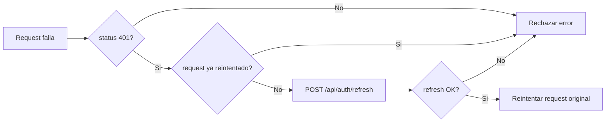

# Services And API Consumption

## Vision general

El frontend concentra el acceso a datos en `src/services` y usa un cliente Axios compartido en `src/api/axios.js`. Esto reduce la logica HTTP en componentes, aunque el manejo de errores no es uniforme en todos los flujos.

## Cliente HTTP base

Archivo: `src/api/axios.js`

Configuracion detectada:

| Configuracion | Valor/uso |
| --- | --- |
| `baseURL` | `VITE_BACKEND_URL` o `http://localhost:3000` |
| `withCredentials` | `true` |
| interceptor de respuesta | reintenta una sola vez tras `401` usando `/api/auth/refresh` |

## Interceptor

Notas:

- El interceptor evita loop infinito si el request fallido ya era `/auth/refresh`.
- No se inyectan headers `Authorization`; la autenticacion parece depender de cookies.

## Tabla de servicios

| Servicio | Metodos | Endpoints | Consumidores principales |
| --- | --- | --- | --- |
| `authService` | `login`, `register`, `logout`, `getProfile`, `forgotPassword`, `validateResetToken`, `resetPassword` | `/api/auth/*`, `/api/users` | `Login`, `Register`, `Navbar`, `AuthProvider`, `ForgotPassword`, `ResetPassword` |
| `presentationService` | `uploadPDF`, `sendText`, `getPresentation`, `getPresentations`, `deletePresentation` | `/api/presentations/*` | `Dashboard`, `ListOfPresentations`, `usePresentationLoader` |
| `slideService` | `getSlides`, `getSlideById`, `createSlide`, `updateSlide`, `deleteSlide`, `duplicateSlide` | `/api/slides/*` | `useSlideSidebar`, `useAddSlideTemplates`, `EditPresentation` |
| `slideElementService` | `createElement`, `updateElement`, `deleteElement` | `/api/slide-elements/*` | `usePresentationEditor` |
| `userImageService` | `getUserImages`, `uploadUserImage`, `markUserImageAsAccessed`, `deleteImage` | `/api/user-images/*` | `AddElementPanel` |
| `templateService` | `getTemplates` | Supabase Storage bucket | `AddElementPanel` |

## Auth service

| Metodo | HTTP | Endpoint | Objetivo |
| --- | --- | --- | --- |
| `login(email, password)` | `POST` | `/api/auth/login` | iniciar sesion |
| `register(email, password, fullName)` | `POST` | `/api/users` | registrar usuario |
| `logout()` | `POST` | `/api/auth/logout` | cerrar sesion |
| `getProfile()` | `GET` | `/api/auth/profile` | bootstrap de sesion |
| `forgotPassword(email)` | `POST` | `/api/auth/forgot-password` | enviar correo de recuperacion |
| `validateResetToken(token)` | `GET` | `/api/auth/validate-reset-token` | validar token |
| `resetPassword(token, newPassword)` | `POST` | `/api/auth/reset-password` | actualizar password |

## Presentation service

| Metodo | HTTP | Endpoint | Payload principal |
| --- | --- | --- | --- |
| `uploadPDF(file, numberOfSlides)` | `POST multipart/form-data` | `/api/presentations/pdf` | archivo PDF y numero de slides |
| `sendText(text, numberOfSlides)` | `POST` | `/api/presentations/text` | texto libre y numero de slides |
| `getPresentation(id)` | `GET` | `/api/presentations/:id` | none |
| `getPresentations()` | `GET` | `/api/presentations/` | none |
| `deletePresentation(id)` | `DELETE` | `/api/presentations/:id` | none |

## Slide service

| Metodo | Estado de uso | Comentario |
| --- | --- | --- |
| `createSlide` | usado | agregar slide o slide con template |
| `updateSlide` | usado | slide order y fondos |
| `deleteSlide` | usado | eliminar slides desde sidebar |
| `duplicateSlide` | usado | duplicado desde sidebar |
| `getSlides` | no usado | posible residuo de una estrategia anterior |
| `getSlideById` | no usado | posible residuo de una estrategia anterior |

## Slide element service

Contrato esperado por `createElement` y `updateElement`:

| Campo | Uso |
| --- | --- |
| `slideId` | relacion con slide |
| `type` | `title`, `text`, `list`, `image` |
| `content` | texto, lista o `resolvedImage` |
| `positionX`, `positionY`, `width`, `height` | coordenadas y dimensiones |
| `styles` | tipografia, color, bordes y alineacion |
| `order` | el frontend envia este campo, pero trabaja visualmente con `zIndex` |

Observacion importante:

- En `usePresentationEditor()`, al actualizar un elemento se envia `element.zIndex` como ultimo argumento del servicio `updateElement()`, cuyo parametro se llama `order`. Esto sugiere una dependencia de contrato backend que deberia documentarse mejor.

## Servicios externos

### Supabase Storage

Uso:

- `templateService.getTemplates()` lista archivos bajo `slides/` en el bucket configurado.
- Cada archivo se transforma a URL publica con `getPublicUrl()`.

Dependencias:

- `VITE_SUPABASE_URL`
- `VITE_SUPABASE_ANON_KEY`
- `VITE_SUPABASE_BUCKET`

## Manejo de errores

### Fortalezas

- Varias operaciones notifican al usuario con `toast`.
- El cliente HTTP contempla refresh de sesion ante `401`.
- `uploadUserImage()` expone progreso de subida al componente.

### Debilidades

| Debilidad | Ejemplo |
| --- | --- |
| Manejo inconsistente de errores | algunos flujos solo usan `console.error`, otros muestran `toast` |
| Sin tipado de errores | no existe una utilidad comun para normalizar mensajes de backend |
| Operaciones optimistas sin rollback | `ListOfPresentations` elimina del estado sin esperar `deletePresentation()` |
| Deteccion incorrecta de status Axios | `Register.jsx` revisa `err.status` en lugar de `err.response?.status` |

## Recomendaciones

1. Crear un helper `getApiErrorMessage(error)` compartido.
2. Homogeneizar errores de red, permisos y validacion de negocio.
3. Alinear `order` vs `zIndex` en el contrato de elementos.
4. Eliminar servicios no usados o reintroducirlos con un caso claro.
5. Agregar tests de servicios e interceptores si el proyecto crece.
