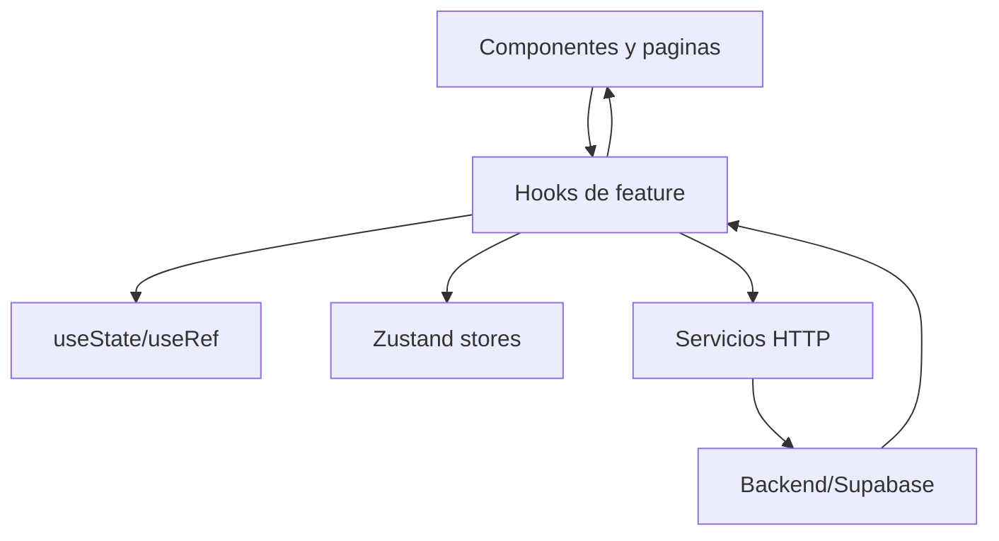

# State Management

## Resumen

El proyecto usa un enfoque de estado minimalista:

- estado global pequeno con `Zustand`
- estado local en paginas y hooks con `useState`
- refs en hooks complejos para evitar cierres obsoletos durante drag, guardado o exportacion

No se detectaron `Redux`, `Context API` de dominio, `RxJS`, `signals`, `ngrx` ni persistencia automatica del estado.

## Stores globales

### `authStore`

Archivo: `src/store/authStore.js`

| Campo | Tipo funcional | Uso |
| --- | --- | --- |
| `user` | objeto o `null` | perfil autenticado |
| `isAuthenticated` | boolean | decision de acceso |
| `loading` | boolean | bootstrap de sesion |

Acciones:

- `setUser(user)`
- `logout()`
- `finishLoading()`

### `presentationStore`

Archivo: `src/store/presentationStore.js`

| Campo | Uso |
| --- | --- |
| `presentation` | cache de la presentacion actual |

Acciones:

- `setPresentation(presentation)`
- `clearPresentation()`

## Estado local importante

| Ubicacion | Estado | Proposito |
| --- | --- | --- |
| `Dashboard.jsx` | `mode`, `file`, `text`, `numberOfSlides`, `loading` | generacion |
| `Login.jsx` | `email`, `password`, `loading` | login |
| `Register.jsx` | `fullName`, `email`, `password`, `confirmPassword`, `errors`, `touched`, `loading` | registro |
| `PresentationPreview.jsx` | depende de hooks | preview, exportacion y modo presentacion |
| `EditPresentation.jsx` | `editCanvasHeight` | altura responsive del canvas |
| `usePresentationEditor()` | estado central del editor | seleccion, toolbar, guardado y contenido |
| `AddElementPanel.jsx` | paneles, biblioteca, uploads | elementos y fondos |

## Flujo de datos

## Comunicacion entre componentes

Patron predominante:

- La pagina crea el estado o usa un hook.
- La pagina pasa datos y callbacks a componentes hijos.
- Los hijos notifican eventos al padre por props.

Ejemplos:

| Relacion | Mecanismo |
| --- | --- |
| `EditPresentation -> EditToolbar` | props de lectura + callbacks de formato |
| `EditPresentation -> SlideSidebar` | slides seleccionados + callbacks de seleccion/actualizacion |
| `ResponsiveEditCanvas -> SlideCanvas` | passthrough de props |
| `SlideCanvas -> SlideElementRenderer` | props por elemento |
| `AddElementPanel -> usePresentationEditor` | callbacks `onAddText`, `onAddImage`, `onAddList` |

## Hook central del editor

`usePresentationEditor()` administra:

- presentacion local editable
- slide seleccionado
- elemento seleccionado
- snapshots para saber si un elemento esta dirty
- toolbar activa
- edicion de texto
- sincronizacion con backend (`syncStatus`)

Esto funciona, pero concentra demasiadas responsabilidades para un solo hook.

## Estrategias tecnicas usadas

| Estrategia | Donde se usa | Motivo |
| --- | --- | --- |
| `useRef` para estado imperativo | `usePresentationEditor`, `useSlideCanvasInteractions`, `usePresentationLoader` | evitar stale closures en eventos/guardados |
| estado derivado | `selectedSlide`, `fontFamilyValue`, `textAlignValue` | simplificar render |
| cache en store global | `presentationStore` | evitar recargas innecesarias entre preview y edit |
| optimistic UI parcial | sidebar y delete de presentaciones | mejorar sensacion de respuesta |

## Limitaciones detectadas

| Limitacion | Impacto |
| --- | --- |
| No hay normalizacion de entidades | las slides y elementos se manipulan como arboles completos |
| No hay persistencia del store | se depende del backend al refrescar |
| Un solo store de presentacion activa | no soporta multitarea o varias presentaciones abiertas |
| Algunos cambios locales no tienen rollback | errores de red pueden dejar divergencia visual |

## Recomendaciones

1. Separar el estado del editor en hooks mas pequenos o un store por feature.
2. Definir modelos de dominio y helpers de actualizacion inmutables centralizados.
3. Incorporar una capa de sincronizacion con rollback para operaciones optimistas.
4. Considerar un store del editor solo si la complejidad sigue creciendo.
